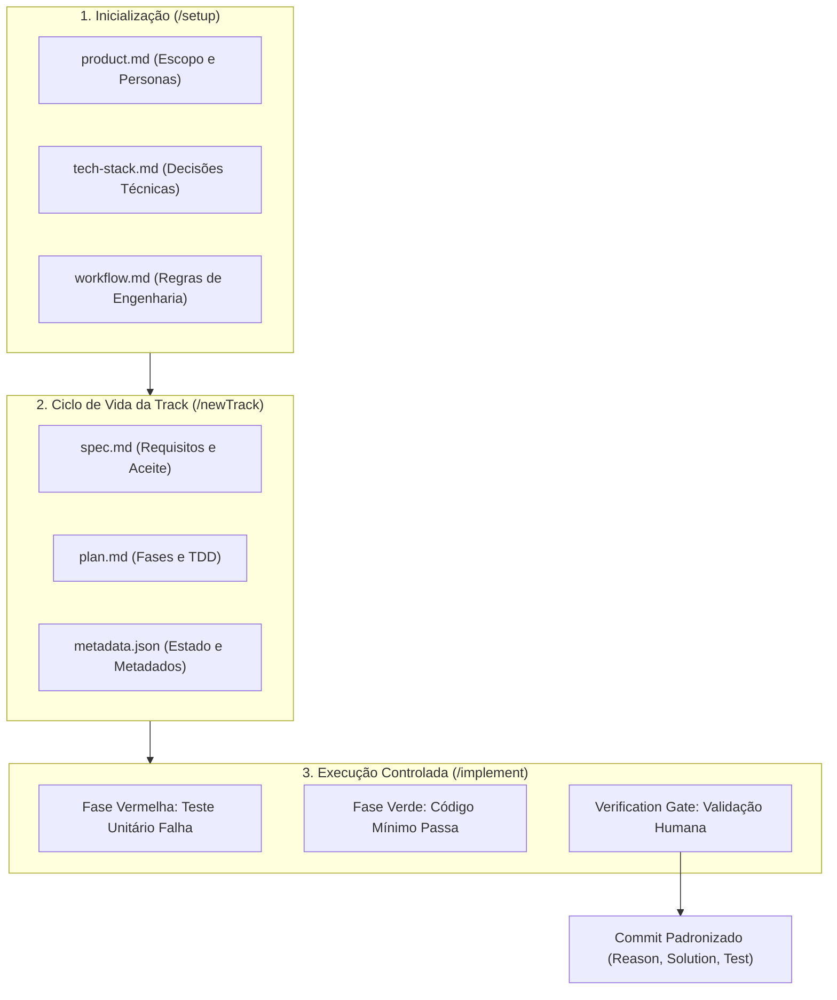
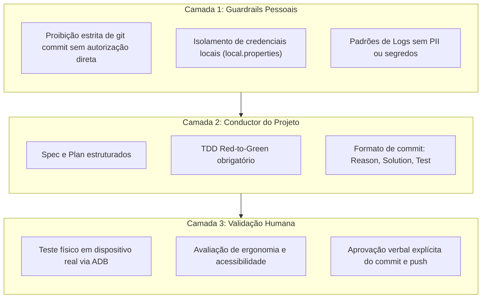
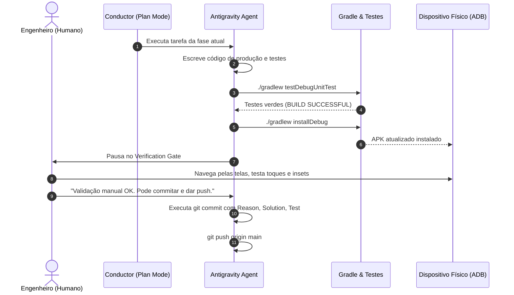

# Além do "Vibe Coding": Como o Conductor e o Context-Driven Development Transformam o Desenvolvimento Android com IA

> **Autor:** Danilo Bertelli  
> **Público-alvo:** Engenheiros Android, Tech Leads e Desenvolvedores de Software  
> **Repositório do Projeto:** [github.com/danilobertelli/GamesCatalog](https://github.com/danilobertelli/GamesCatalog)

---

## 1. O Paradoxo da IA na Engenharia: Velocidade vs. Débito Técnico

Nos últimos meses, o termo *"vibe coding"* ganhou força nas redes: a ideia sedutora de abrir uma janela de chat, descrever em linguagem natural o que você quer e deixar um modelo de linguagem cuspir centenas de linhas de código em segundos.

Para protótipos de fim de semana ou scripts pontuais, essa abordagem funciona bem. Mas quem vive o dia a dia da engenharia de software em bases de código reais sabe o que acontece em seguida:
- Arquitetura inconsistente com classes acumulando responsabilidades demais;
- Strings literais espalhadas pelas telas;
- Falta de testes automatizados ou testes superficiais que testam apenas mocks triviais;
- Regras de negócio acopladas diretamente na camada de interface;
- Alucinações silenciosas de bibliotecas e métodos obsoletos.

O problema não está nos modelos de linguagem em si. Modelos de fronteira conhecem muito sobre sintaxe de linguagens como Kotlin e padrões de bibliotecas modernas como Jetpack Compose. O gargalo real é a **falta de contexto estruturado e governança técnica**. 

Quando um modelo opera sem limites explícitos, sem uma especificação formal e sem um ciclo de verificação contínua, ele otimiza apenas para agradar no próximo token gerado, e não para a sustentabilidade da aplicação a longo prazo.

Neste artigo, apresento uma alternativa prática a esse caos: o **Context-Driven Development (CDD)** orquestrado pelo **Conductor**, utilizando o ecossistema **Google Antigravity**. 

Para validar essa metodologia na prática, construí do zero o **GamesCatalog**, um aplicativo Android moderno com suporte a catálogo de jogos, cadastro de plataformas, persistência local offline com Room, UI reativa com Jetpack Compose e busca remota via API oficial da IGDB com autenticação OAuth2 da Twitch.

---

## 2. O que é o Conductor e o Context-Driven Development?

O Conductor é uma ferramenta de orquestração de desenvolvimento desenhada para manter a IA estritamente alinhada às decisões de arquitetura e ao processo da equipe. Em vez de prompts soltos em janelas de conversa descartáveis, o Conductor estrutura todo o ciclo de vida do software em arquivos Markdown versionados no próprio Git, sob a pasta `conductor/`.



### O Triângulo de Contexto do Projeto
Ao iniciar um projeto com o comando `/setup`, o Conductor não gera código de imediato. Ele estabelece três documentos de referência que alimentam o contexto do agente em cada interação futura:

1. **`product.md`**: Define o propósito da aplicação, público-alvo e regras centrais do negócio. A IA passa a entender o *porquê* de cada tela existir.
2. **`tech-stack.md`**: O inventário de decisões técnicas inegociáveis. No nosso caso: Kotlin 2.0+, Android SDK 35/36, Jetpack Compose com Material 3, Room 2.7, Coroutines/Flow, Retrofit e Coil. A IA é proibida de sugerir soluções fora desse ecossistema.
3. **`workflow.md`**: As regras de governança da equipe. Define o uso obrigatório de TDD (Red ➔ Green), a convenção de commits com seções de *Reason*, *Solution* e *Test*, e os pontos de parada obrigatórios antes de qualquer modificação em branches principais.

### As Tracks como Unidades Atômicas de Trabalho
Com o ecossistema configurado, qualquer nova tarefa — seja uma funcionalidade nova, um bugfix ou uma refatoração — nasce como uma **Track** via comando `/newTrack`.

Cada track é isolada em seu próprio diretório (`conductor/tracks/<nome_da_track>/`) e possui:
- **`spec.md`**: Especificação técnica com requisitos funcionais, requisitos não-funcionais e critérios de aceitação mensuráveis.
- **`plan.md`**: Plano de implementação granular quebrado em fases sequenciais com caixas de seleção (`[ ]`, `[~]`, `[x]`). Cada fase exige testes unitários prévios e um gate de verificação.
- **`metadata.json`**: Registro estruturado de estado da track (`new`, `in_progress`, `completed`).

O arquivo `conductor/tracks.md` funciona como o painel central do projeto, consolidando todas as tracks e seus respectivos status.

---

## 3. Governança em Camadas: Mantendo o Engenheiro no Comando

Um dos maiores riscos ao trabalhar com agentes que têm acesso ao terminal é a perda de controle sobre o versionamento. Se deixado livre, o agente pode commitar arquivos quebrados, queimar histórico de commits úteis ou vazar segredos locais para o repositório remoto.

Para eliminar esse risco, estabelecemos o princípio de **Governança em Camadas**:



- **A IA nunca commita sozinha**: O agente pode rodar o Gradle, executar testes unitários, inspecionar logs e até compilar e instalar o APK no dispositivo físico via ADB. Porém, o comando `git commit` só pode ser executado após uma instrução explícita do desenvolvedor humano.
- **Formato Rígido de Commits**: Todo commit segue o formato:
  - Primeira linha: `<tipo/escopo>: <resumo imperativo curto>`.
  - Corpo dividido nas seções `Reason`, `Solution` e `Test`, com quebra de linha em 72 caracteres.
- **Isolamento de Segredos**: Arquivos como `local.properties` (que guardam chaves de API da Twitch e IGDB) são checados continuamente para garantir que nunca sejam adicionados à área de staging do Git.

---

## 4. O Estudo de Caso: Construindo o GamesCatalog Passo a Passo

Para demonstrar como essa dinâmica funciona no dia a dia, vamos analisar as seis tracks que construíram a aplicação, destacando os desafios técnicos reais e as intervenções humanas necessárias em cada uma.

---

### Track 1: Fundação Local, Room e Desafios de Build

A primeira track (`core_storage_koin_20260917`) teve como missão criar o banco de dados local Room, os modelos de domínio e os contratos de repositório.

#### O Ciclo Red ➔ Green na Prática
Antes de criar qualquer classe de domínio, o agente gerou o arquivo de teste unitário `GameTest.kt`:

```kotlin
class GameTest {
    @Test
    fun `instantiating game with valid parameters succeeds`() {
        val game = Game(
            id = "game-1",
            title = "Chrono Trigger",
            overview = "A classic RPG involving time travel.",
            coverImageUrl = "https://example.com/cover.jpg",
            platforms = listOf("SNES", "PlayStation"),
            status = GameStatus.COMPLETED,
            rating = 5
        )

        assertEquals("Chrono Trigger", game.title)
        assertEquals(GameStatus.COMPLETED, game.status)
        assertEquals(5, game.rating)
    }
}
```

O agente executou `./gradlew testDebugUnitTest` no terminal. O build falhou imediatamente porque a classe `Game` e o enum `GameStatus` ainda não existiam — a **fase vermelha** do TDD confirmada. 

Em seguida, o agente implementou os modelos no pacote de domínio e executou o Gradle novamente até obter a **fase verde**. O mesmo processo foi repetido para o `GameDao` e o `GameRepositoryImpl`, utilizando banco em memória com Robolectric e a biblioteca Turbine para testar as emissões de `Flow<List<Game>>`.

#### O Desafio Real da JVM e o Version Catalog
Durante a configuração, nos deparamos com um conflito técnico comum em versões recentes de ferramentas: o alinhamento da JVM entre o daemon do Gradle e o compilador Kotlin 2.2 com AGP 8.9+. 

Em vez de esconder o erro ou tentar contornos frágeis, o Conductor registrou a incompatibilidade na fase correspondente do plano e alinhamos a JVM para o OpenJDK 21 via `gradle.properties`, mantendo o `libs.versions.toml` limpo e declarativo.

---

### Track 2: UI Reativa em Compose e o Choque de Realidade no Hardware Físico

Com a camada de dados testada e estável, a segunda track (`ui_games_catalog_screen_20260917`) teve como foco a tela principal de catálogo.

#### ViewModel Reativo com StateFlow
Na camada de apresentação, aplicamos Unidirectional Data Flow (UDF). A ViewModel combina o fluxo contínuo do banco de dados com a string de busca digitada pelo usuário:

```kotlin
@OptIn(ExperimentalCoroutinesApi::class)
class GamesCatalogViewModel(
    private val repository: GameRepository
) : ViewModel() {

    private val _searchQuery = MutableStateFlow("")
    val searchQuery: StateFlow<String> = _searchQuery.asStateFlow()

    val uiState: StateFlow<GamesCatalogUiState> = _searchQuery
        .combine(repository.getAllGames()) { query, games ->
            val filtered = if (query.isBlank()) {
                games
            } else {
                games.filter { it.title.contains(query, ignoreCase = true) }
            }
            GamesCatalogUiState(
                games = filtered.sortedBy { it.title },
                isLoading = false,
                searchQuery = query
            )
        }
        .stateIn(
            scope = viewModelScope,
            started = SharingStarted.WhileSubscribed(5_000),
            initialValue = GamesCatalogUiState(isLoading = true)
        )
}
```

#### O Bug Visual do Edge-to-Edge no Dispositivo Real
Aqui aconteceu um dos momentos mais instrutivos do projeto:
1. Com o `enableEdgeToEdge()` ativo na `MainActivity`, a barra superior do aplicativo desenhou diretamente por baixo da barra de status do sistema.
2. Ao rodar o app no meu aparelho físico conectado via USB, notei que o título *"My Games"* colidia com o relógio e os ícones de bateria.
3. Solicitei a investigação. O agente utilizou o comando `adb shell screencap` para capturar a tela do hardware, analisou a imagem gerada e constatou visualmente a colisão de insets.
4. A correção foi cirúrgica: adicionar `Modifier.statusBarsPadding()` na coluna superior da tela. Um novo screenshot foi capturado via ADB confirmando o alinhamento correto.

#### A Diretriz Inegociável: Sem Strings Literais
Mesmo com o layout ajustado e testes unitários passando, identifiquei que textos como títulos e botões haviam sido escritos como strings literais dentro dos arquivos composable. 

Parei a execução e exigi a extração imediata de 100% das strings para `res/values/strings.xml`, incluindo textos de acessibilidade (`contentDescription`) e suporte a parâmetros de formatação (`%1$d/5`, `%1$s`). A velocidade da IA só agrega valor quando preserva os fundamentos da plataforma.

---

### Track 3: Refinamento de Domínio Pré-UI (Prevenindo o Caos de Dados)

Na terceira track (`ui_add_game_screen_20260917`), avançamos para a tela de cadastro de novos jogos. 

Antes de construir o formulário, analisei a especificação inicial e identifiquei um problema clássico de arquitetura:
> Se o campo de plataformas fosse um campo de texto livre, os usuários cadastrariam a mesma plataforma de formas diferentes: *"PS5"*, *"Playstation 5"*, *"ps 5"*, *"play5"*. Isso corromperia a integridade dos dados e impediria filtros consistentes no futuro.

Interrompi o plano antes que qualquer linha de UI fosse escrita e orientei a criação de uma fase prévia de domínio:
1. Criar a entidade `PlatformEntity` e a tabela `platforms` no Room;
2. Atualizar a versão do banco de dados Room com migração segura;
3. Criar uma lista com 28 plataformas pré-cadastradas (`PreseededPlatforms`), contemplando ecossistemas modernos e retrô;
4. Criar o `PlatformRepository` com rotina de inicialização automática no primeiro boot.

Com a base de dados consistente, a tela de cadastro pôde ser construída com seleção múltipla de chips dinâmicos (`FilterChip` dentro de um `FlowRow`), garantindo que o usuário selecione plataformas padronizadas.

---

### Track 4: Gestão do Dado e o "Human in the Loop"

A quarta track (`ui_game_detail_screen_20260917`) fechou o CRUD local com a tela de detalhes, edição e exclusão.

Aqui estabelecemos uma regra clara de design de produto:
- **Campos imutáveis**: Título e plataformas não podem ser alterados após o cadastro (evitando que o usuário renomeie um jogo e deixe o histórico sem sentido).
- **Campos editáveis**: Status de progresso (`Want to Play`, `Playing`, `Completed`, `Abandoned`), nota por estrelas (1 a 5) e resenha pessoal.
- **Ação destrutiva protegida**: A exclusão só acontece mediante confirmação explícita em um `AlertDialog`.



Nesta track, deixei registrado um dos princípios mais importantes do pareamento com agentes autônomos:
> *"Manual verification pode deixar com o desenvolvedor, garanta apenas a instalação no final do processo."*

A divisão de trabalho é simples: a IA garante a cobertura automatizada, a integridade de compilação e a entrega do binário no dispositivo de teste. O desenvolvedor humano valida a experiência de uso real: ergonomia, resposta tátil ao toque, legibilidade e comportamento do teclado virtual. Somente após essa validação física o sinal verde para o commit é concedido.

---

### Track 5: Consumo Consciente de APIs Externas (Twitch OAuth2 + IGDB)

Na quinta track (`api_igdb_integration_20260917`), transformamos o aplicativo em uma experiência conectada à base de dados mundial da indústria gamer através da API da IGDB.

#### Pesquisa de Documentação Antes do Código
Uma das maiores fontes de alucinação de IA ocorre quando ela inventa endpoints ou schemas de bibliotecas que mudaram de versão. Para evitar isso, começamos com uma ordem explícita: analisar a documentação técnica oficial da IGDB (`api-docs.igdb.com`).

A análise revelou particularidades cruciais que impactaram diretamente a arquitetura:
1. A IGDB utiliza uma sintaxe própria de consulta no corpo das requisições chamada **Apicalypse** (`fields name, summary, cover.image_id; search "..."; limit 8;`), enviada como `text/plain`.
2. As URLs de capas não vêm prontas: a API devolve um `image_id` alfanumérico que deve ser montado contra o CDN da IGDB (`https://images.igdb.com/igdb/image/upload/t_cover_big/{image_id}.jpg`).
3. O acesso exige autenticação prévia contra a API da Twitch via fluxo de `client_credentials` do OAuth2.

#### Autenticação Thread-Safe com Mutex
Para gerenciar o ciclo de vida do token de acesso da Twitch, criamos o `TwitchTokenManager`. O componente armazena o token em memória com margem de segurança de 60 segundos antes da expiração e utiliza um `Mutex` para evitar chamadas de rede concorrentes:

```kotlin
class TwitchTokenManagerImpl(
    private val authService: TwitchAuthService,
    private val clientId: String,
    private val clientSecret: String
) : TwitchTokenManager {

    private val mutex = Mutex()
    private var cachedToken: String? = null
    private var tokenExpiryEpochSeconds: Long = 0L

    override suspend fun getAccessToken(): Result<String> = mutex.withLock {
        val currentEpoch = Instant.now().epochSecond
        val token = cachedToken

        if (token != null && currentEpoch < (tokenExpiryEpochSeconds - EXPIRATION_BUFFER_SECONDS)) {
            Log.d(TAG, "Reusing valid cached Twitch OAuth token")
            return Result.success(token)
        }

        runCatching {
            val response = authService.getAccessToken(
                clientId = clientId,
                clientSecret = clientSecret
            )
            cachedToken = response.accessToken
            tokenExpiryEpochSeconds = currentEpoch + response.expiresIn
            Log.d(TAG, "Acquired new Twitch OAuth token (expires in ${response.expiresIn}s)")
            response.accessToken
        }.onFailure { error ->
            Log.e(TAG, "Failed to authenticate with Twitch OAuth2", error)
        }
    }

    companion object {
        private const val TAG = "TwitchTokenManager"
        private const val EXPIRATION_BUFFER_SECONDS = 60L
    }
}
```

#### Autocomplete Reativo na UI com Debounce
Na tela de cadastro, o título digitado alimenta um fluxo reativo que só dispara a busca na API após o usuário pausar a digitação por 400 milissegundos e ter digitado ao menos 3 caracteres:

```kotlin
@OptIn(FlowPreview::class, ExperimentalCoroutinesApi::class)
val remoteSearchResults: StateFlow<List<GameSearchResult>> = _title
    .debounce(400)
    .distinctUntilChanged()
    .mapLatest { query ->
        val trimmed = query.trim()
        if (trimmed.length < 3) {
            emptyList()
        } else {
            igdbRepository.searchGames(trimmed).getOrDefault(emptyList())
        }
    }
    .stateIn(
        scope = viewModelScope,
        started = SharingStarted.WhileSubscribed(5_000),
        initialValue = emptyList()
    )
```

Ao tocar em um resultado da lista, o formulário se preenche sozinho: título, sinopse, capa em alta resolução via Coil e seleção automática dos chips de plataformas correspondentes já cadastrados no Room.

---

### Track 6: Sustentabilidade, Logs e o Bug Oculto de Toolchains

Muitos projetos assistidos por IA encerram quando a última tela fica pronta. No nosso fluxo, adicionamos uma track final de sustentação e documentação (`support_docs_logs_readme_20260917`).

#### KDoc em 100% dos Contratos
Todas as interfaces de repositório, DAOs, serviços de rede e ViewModels receberam documentação estruturada KDoc, detalhando parâmetros, comportamentos assíncronos e contratos de retorno.

#### Logs Estruturados sem Vazamento de Dados
Adicionamos `Log.d` e `Log.e` em pontos críticos (ciclo de tokens, chamadas à IGDB e operações de banco de dados). Para garantir a privacidade, **nenhum segredo ou token bruto é registrado em log** — apenas eventos de ciclo de vida e tempo de expiração.

Para que esses logs funcionassem sem quebrar a execução de testes unitários locais na JVM, adicionamos a seguinte configuração no `app/build.gradle.kts`:

```kotlin
android {
    testOptions {
        unitTests.isReturnDefaultValues = true
    }
}
```

#### A Batalha Real com as Gradle Toolchains no Windows
Durante a verificação final da Track 6, nos deparamos com um erro de build inesperado:

```text
Execution failed for JdkImageTransform: core-for-system-modules.jar.
> jlink executable C:\Users\...\.vscode\extensions\redhat.java-...\jre\...\bin\jlink.exe does not exist.
```

O mecanismo de auto-detecção de JVM Toolchains do Gradle vasculhou o disco da máquina e descobriu o JRE embutido da extensão Java do VS Code. Como esse ambiente era apenas um JRE e não um JDK completo, ele não continha o executável `jlink.exe`, quebrando a transformação de módulos do Android Gradle Plugin.

A solução técnica foi desativar a auto-detecção e fixar o caminho absoluto do JDK completo no `gradle.properties`:

```properties
org.gradle.java.installations.auto-detect=false
org.gradle.java.installations.paths=C:/Users/vntdabe.VENTURUS/.jdks/jbr-21.0.9
```

Esse é o tipo de problema que nenhuma IA prevê sozinha se deixada sem supervisão. É a experiência do engenheiro que identifica a causa raiz e guia a ferramenta até a correção definitiva.

#### A Track 6 Poderia Ter Sido Evitada? O Poder da Evolução do Contexto

Uma reflexão honesta sobre o processo: **a Track 6 precisava ter existido como uma etapa separada?**

A resposta direta é: **não**. Se durante a fase inicial de setup (`/setup`) tivéssemos registrado explicitamente no `conductor/workflow.md` e no `conductor/tech-stack.md` que:
1. Toda classe, interface ou método público deve nascer acompanhado de documentação KDoc;
2. Toda operação de rede, autenticação e persistência deve conter logs estruturados (`Log.d`/`Log.e`) com tags dedicadas e sem expor credenciais sensíveis;

O agente teria gerado cada uma das cinco tracks anteriores com documentação e logs incorporados desde o primeiro minuto. O plano de cada track teria tarefas automáticas de KDoc e logging dentro do próprio ciclo de TDD, tornando desnecessária uma track retroativa de suporte.

No entanto, essa percepção revela uma das características mais práticas do Conductor: **os arquivos de contexto não são monolitos imutáveis**.

O desenvolvimento de software é um processo de aprendizado contínuo. Conforme identificamos lacunas ou novos padrões de qualidade para o time, podemos atualizar diretamente os arquivos raiz:
- Atualizamos o `conductor/workflow.md` para incluir as diretrizes de KDoc e Logs estruturados obrigatórios em cada tarefa;
- Atualizamos o `conductor/tech-stack.md` para registrar a convenção de observabilidade e a configuração de mocks de log na JVM.

A partir do momento em que esses arquivos são atualizados, **todas as próximas tracks criadas pelo comando `/newTrack` passam a herdar essas regras automaticamente como verdades inegociáveis**. O contexto do projeto amadurece junto com o time, evitando que débitos técnicos semelhantes voltem a acontecer.

---

## 5. Os Cinco Mandamentos da Engenharia com IA

Após desenvolver uma aplicação completa orientada por especificações e tracks do Conductor, consolidei cinco aprendizados essenciais:

1. **A IA precisa de limites explícitos, não de liberdade irrestrita**:  
   Sem regras formais de stack e workflow, a IA adota atalhos que parecem funcionais no primeiro commit, mas geram débito técnico insolúvel no décimo.
2. **O teste unitário que falha primeiro é o seu escudo contra alucinações**:  
   Se um teste não falhou antes da implementação existir, você não tem garantia de que o código gerado pela IA realmente resolveu o problema.
3. **O emulador engana; o hardware físico não perdoa**:  
   Problemas de sobreposição de barra de status (edge-to-edge), comportamento do teclado virtual e resposta tátil só existem de verdade na palma da sua mão.
4. **Governança em camadas é obrigatória**:  
   A IA pode analisar, propor e testar; a decisão final de commitar e publicar código deve ser exclusivamente humana.
5. **O contexto deve evoluir com o projeto**:  
   Os arquivos do Conductor (`workflow.md`, `tech-stack.md`) são documentos vivos. Sempre que você identificar que a IA deixou de lado uma boa prática que a equipe valoriza — como KDoc ou instrumentação de logs —, não faça apenas uma correção isolada no código; atualize o arquivo de regras do Conductor para que as próximas tracks assumam essa exigência como padrão definitivo.

---

## Conclusão

O desenvolvimento assistido por inteligência artificial não veio para transformar engenheiros de software em meros espectadores. Pelo contrário: à medida que a velocidade de geração de código aumenta, a responsabilidade do engenheiro de atuar como **arquiteto, revisor rigoroso e diretor técnico** torna-se ainda mais indispensável.

O Conductor e o Context-Driven Development mostram que é possível aproveitar a alta produtividade dos agentes autônomos sem abrir mão de rigor arquitetural, TDD e boas práticas de engenharia.

O código-fonte completo do **GamesCatalog**, incluindo todas as tracks, especificações e planos de implementação do Conductor, está disponível publicamente no GitHub:

👉 **[github.com/danilobertelli/GamesCatalog](https://github.com/danilobertelli/GamesCatalog)**
