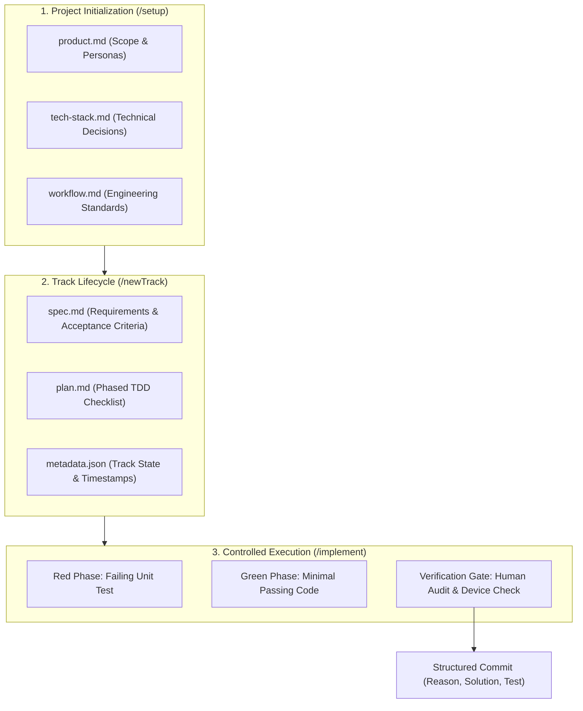
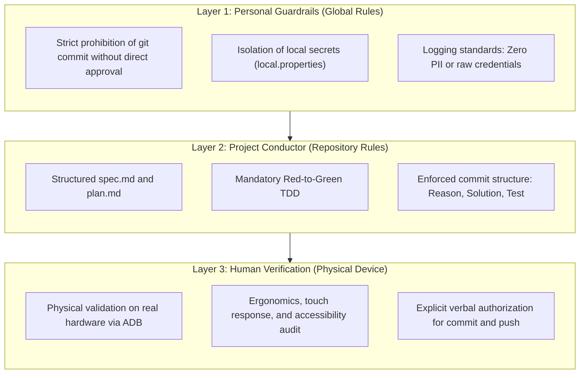
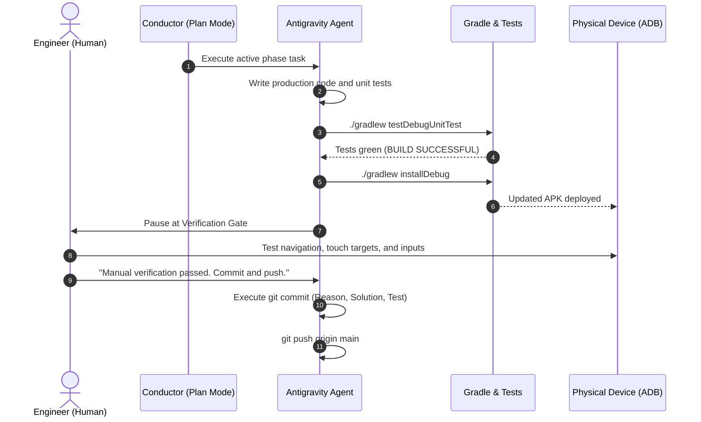

# Beyond "Vibe Coding": How Conductor and Context-Driven Development Transform Android Engineering with AI

> **Author:** Danilo Bertelli  
> **Target Audience:** Android Engineers, Tech Leads, and Software Architects  
> **Project Repository:** [github.com/danilobertelli/GamesCatalog](https://github.com/danilobertelli/GamesCatalog)

---

## 1. The Engineering Paradox of AI: Velocity vs. Technical Debt

Over the past few months, the term *"vibe coding"* has taken over developer feeds: the appealing idea of opening a prompt window, describing what you want in loose natural language, and letting a large language model generate hundreds of lines of code in seconds.

For weekend prototypes or throwaway scripts, that workflow can feel magical. But anyone maintaining production-grade software knows what follows:
- An erratic architecture with god-classes accumulating too many responsibilities;
- Hardcoded string literals scattered across UI components;
- Missing automated test suites, or superficial tests validating trivial mocks;
- Business rules coupled directly to UI lifecycles;
- Silent hallucinations of deprecated APIs and phantom dependencies.

The issue is not the underlying model. State-of-the-art LLMs possess deep knowledge of Kotlin syntax, modern Jetpack Compose idioms, and coroutine primitives. The real bottleneck is **the lack of structured context and technical governance**.

When an agent operates without explicit boundaries, a formal specification, and a continuous verification loop, it optimizes for generating plausible tokens—not for long-term codebase health.

In this article, I present a practical engineering framework to replace that chaos: **Context-Driven Development (CDD)** orchestrated by **Conductor**, running on the **Google Antigravity** platform.

To stress-test this methodology on real hardware, I built **GamesCatalog** from scratch: a modern Android app featuring offline-first local persistence with Room, reactive UI with Jetpack Compose, and remote search via the official IGDB API with Twitch OAuth2 authentication. Every single line of code was developed alongside an autonomous agent operating under strict engineering guardrails.

---

## 2. What Is Conductor and Context-Driven Development?

Conductor is an orchestration framework designed to keep AI agents strictly aligned with your team's architectural decisions and engineering standards. Instead of ephemeral chat prompts, Conductor grounds the entire software lifecycle in versioned Markdown documents inside a root `conductor/` directory.



### The Project Context Triangle
When bootstrapping a project via the `/setup` command, Conductor does not jump straight into code generation. It establishes three source-of-truth documents that feed the agent's context in every subsequent interaction:

1. **`product.md`**: Defines the application purpose, user personas, and core business rules. The agent understands *why* each screen exists.
2. **`tech-stack.md`**: The inventory of non-negotiable technical choices. In our project: Kotlin 2.0+, Android SDK 35/36, Jetpack Compose with Material 3, Room 2.7, Coroutines/Flow, Retrofit, and Coil. The agent is prevented from suggesting off-stack libraries.
3. **`workflow.md`**: Team governance rules. It mandates strict TDD (Red ➔ Green), a structured commit message format (*Reason, Solution, Test*), and mandatory pause points before touching git branches.

### Tracks as Atomic Units of Work
Once the project foundation is set, any unit of work—whether a feature, a bugfix, or refactoring—is created as an isolated **Track** using `/newTrack`.

Each track lives in its own directory (`conductor/tracks/<track_name>/`) containing:
- **`spec.md`**: Functional requirements, non-functional constraints, and verifiable acceptance criteria.
- **`plan.md`**: A phased implementation plan broken down into granular tasks with interactive checkboxes (`[ ]`, `[~]`, `[x]`). Every phase requires unit tests and a verification gate.
- **`metadata.json`**: Machine-readable state tracking (`new`, `in_progress`, `completed`).

The root `conductor/tracks.md` file acts as the project dashboard, indexing every track and its current status.

---

## 3. Layered Governance: Keeping the Engineer in Command

One of the biggest concerns when working with agents that have terminal access is losing control over the Git commit history. Left unconstrained, an agent can commit broken code, overwrite clean histories, or accidentally stage local secrets.

To eliminate this risk, we enforce **Layered Governance**:



- **The AI Never Commits Autonomously**: The agent can run Gradle tasks, execute unit tests, inspect logs, build APKs, and install builds onto a connected physical device via ADB. However, executing `git commit` is gated behind an explicit, verbatim command from the engineer.
- **Structured Commit Standard**: Every commit strictly follows:
  - Subject line: `<type/scope>: <short imperative summary>`.
  - Body broken down into `Reason`, `Solution`, and `Test` sections, hard-wrapped at 72 characters.
- **Secret Isolation**: Configuration files such as `local.properties` (holding Twitch and IGDB API credentials) are verified against `.gitignore` to ensure they are never staged.

---

## 4. Case Study: Building GamesCatalog Step by Step

To see how this works in practice, let us walk through the six tracks that brought the application to life, highlighting the real-world obstacles and technical interventions at each step.

---

### Track 1: Solid Local Foundations, Room, and Gradle JVM Realities

The objective of the first track (`core_storage_koin_20260917`) was to establish the local persistence layer, domain models, and repository contracts.

#### Red ➔ Green TDD in Practice
Before any production model existed, the agent wrote a failing unit test in `GameTest.kt`:

```kotlin
class GameTest {
    @Test
    fun `instantiating game with valid parameters succeeds`() {
        val game = Game(
            id = "game-1",
            title = "Chrono Trigger",
            overview = "A classic RPG involving time travel.",
            coverImageUrl = "https://example.com/cover.jpg",
            platforms = listOf("SNES", "PlayStation"),
            status = GameStatus.COMPLETED,
            rating = 5
        )

        assertEquals("Chrono Trigger", game.title)
        assertEquals(GameStatus.COMPLETED, game.status)
        assertEquals(5, game.rating)
    }
}
```

Running `./gradlew testDebugUnitTest` immediately failed because `Game` and `GameStatus` were not yet defined—confirming the **Red phase**.

The agent then implemented the immutable domain models and re-ran Gradle until reaching the **Green phase**. We followed the exact same workflow for `GameDao` and `GameRepositoryImpl`, using an in-memory SQLite instance via Robolectric and the Turbine library to assert reactive emissions from `Flow<List<Game>>`.

#### Real-World Gradle and JVM Alignment
During setup, we hit a real toolchain friction point: a bytecode and toolchain mismatch between the Gradle daemon and Kotlin 2.2 on AGP 8.9+. 

Rather than hiding the error behind fragile flags, Conductor recorded the issue in the plan, and we pinned the daemon to OpenJDK 21 via `gradle.properties`, maintaining a clean, declarative `libs.versions.toml`.

---

### Track 2: Reactive Compose UI and Hardware Reality Checks

With our data layer tested and stable, Track 2 (`ui_games_catalog_screen_20260917`) addressed the catalog screen.

#### Reactive ViewModel with StateFlow
In the presentation layer, we implemented Unidirectional Data Flow (UDF). The ViewModel combines the database observable flow with the search query input by the user:

```kotlin
@OptIn(ExperimentalCoroutinesApi::class)
class GamesCatalogViewModel(
    private val repository: GameRepository
) : ViewModel() {

    private val _searchQuery = MutableStateFlow("")
    val searchQuery: StateFlow<String> = _searchQuery.asStateFlow()

    val uiState: StateFlow<GamesCatalogUiState> = _searchQuery
        .combine(repository.getAllGames()) { query, games ->
            val filtered = if (query.isBlank()) {
                games
            } else {
                games.filter { it.title.contains(query, ignoreCase = true) }
            }
            GamesCatalogUiState(
                games = filtered.sortedBy { it.title },
                isLoading = false,
                searchQuery = query
            )
        }
        .stateIn(
            scope = viewModelScope,
            started = SharingStarted.WhileSubscribed(5_000),
            initialValue = GamesCatalogUiState(isLoading = true)
        )
}
```

#### The Edge-to-Edge Layout Clash on Real Hardware
Here, a textbook human-in-the-loop moment occurred:
1. With `enableEdgeToEdge()` enabled in `MainActivity`, the top app bar drew directly behind the system status bar.
2. Running the build on my USB-connected physical device, I immediately spotted that the title *"My Games"* clashed with the status bar clock and battery icons.
3. I asked the agent to inspect the screen. It ran `adb shell screencap`, pulled the screenshot, and visually confirmed the missing insets.
4. The fix was clean: applying `Modifier.statusBarsPadding()` to the top bar column. A second ADB screenshot confirmed the correct layout.

#### The Non-Negotiable Standard: Zero Hardcoded Strings
Even though the layout was fixed and all unit tests were green, I noticed the composables contained hardcoded English strings.

I halted the workflow and instructed the agent to extract 100% of the UI texts to `res/values/strings.xml`, including accessibility descriptions (`contentDescription`) and formatted placeholders (`%1$d/5`, `%1$s`). High developer velocity is only useful if it upholds standard platform practices.

---

### Track 3: Pre-UI Domain Refinement (Preventing Data Chaos)

In Track 3 (`ui_add_game_screen_20260917`), we began working on the game creation screen.

Before assembling form components, I reviewed the initial spec and caught a critical data modeling risk:
> If the platform input were a free-text field, users would enter variations of the same name: *"PS5"*, *"Playstation 5"*, *"ps 5"*, *"play5"*. That would corrupt database integrity and make future filtering impossible.

I paused UI work and added a prerequisite domain phase to the track plan:
1. Define a dedicated `PlatformEntity` and a `platforms` table in Room;
2. Increment the Room database version with a clean migration;
3. Pre-seed 28 standard gaming platforms (`PreseededPlatforms`) covering modern and retro consoles;
4. Implement `PlatformRepository` with automated first-boot seeding.

With that foundation in place, the form was built using dynamic multi-select chips (`FilterChip` inside a `FlowRow`), ensuring users select standardized platforms.

---

### Track 4: Data Lifecycle Management & "Human in the Loop"

Track 4 (`ui_game_detail_screen_20260917`) completed local CRUD operations with game inspection, editing, and deletion.

We established clear business rules upfront:
- **Immutable Fields**: The game title and original platforms cannot be modified after creation, preserving historical records.
- **Editable Fields**: Progress status (`Want to Play`, `Playing`, `Completed`, `Abandoned`), star rating (1 to 5), and player notes.
- **Guarded Destructive Actions**: Deletion requires explicit confirmation inside an `AlertDialog`.



During this track, I set a rule that captures the core dynamic of AI pair programming:
> *"Leave manual verification to the developer; just ensure the APK is installed at the end of the process."*

The division of labor is balanced: the AI guarantees unit test coverage, compile-time validation, and device deployment. The human engineer evaluates the tactile experience: ergonomics, touch targets, keyboard interactions, and visual rhythm. Only after that hands-on check is the green light for `git commit` given.

---

### Track 5: Conscious API Consumption (Twitch OAuth2 + IGDB)

Track 5 (`api_igdb_integration_20260917`) connected the application to the video game industry's comprehensive database through the IGDB API.

#### Reading Upstream Documentation Before Writing Code
One of the most common causes of AI hallucination is assuming API contracts before reading the official documentation. We started this track with a strict mandate: thoroughly analyze the official IGDB documentation (`api-docs.igdb.com`).

The investigation revealed three architectural requirements:
1. IGDB queries require the proprietary **Apicalypse** query syntax in request bodies (`fields name, summary, cover.image_id; search "..."; limit 8;`), sent as `text/plain`.
2. Image URLs are not returned directly. The API returns an alphanumeric `image_id` that must be formatted against the IGDB CDN (`https://images.igdb.com/igdb/image/upload/t_cover_big/{image_id}.jpg`).
3. Authentication requires a Twitch developer OAuth2 token using the `client_credentials` grant flow.

#### Thread-Safe Token Management with Mutex
To handle the Twitch authentication lifecycle, we built `TwitchTokenManager`. It caches tokens in memory with a 60-second expiration buffer and uses a coroutine `Mutex` to prevent concurrent token refresh calls:

```kotlin
class TwitchTokenManagerImpl(
    private val authService: TwitchAuthService,
    private val clientId: String,
    private val clientSecret: String
) : TwitchTokenManager {

    private val mutex = Mutex()
    private var cachedToken: String? = null
    private var tokenExpiryEpochSeconds: Long = 0L

    override suspend fun getAccessToken(): Result<String> = mutex.withLock {
        val currentEpoch = Instant.now().epochSecond
        val token = cachedToken

        if (token != null && currentEpoch < (tokenExpiryEpochSeconds - EXPIRATION_BUFFER_SECONDS)) {
            Log.d(TAG, "Reusing valid cached Twitch OAuth token")
            return Result.success(token)
        }

        runCatching {
            val response = authService.getAccessToken(
                clientId = clientId,
                clientSecret = clientSecret
            )
            cachedToken = response.accessToken
            tokenExpiryEpochSeconds = currentEpoch + response.expiresIn
            Log.d(TAG, "Acquired new Twitch OAuth token (expires in ${response.expiresIn}s)")
            response.accessToken
        }.onFailure { error ->
            Log.e(TAG, "Failed to authenticate with Twitch OAuth2", error)
        }
    }

    companion object {
        private const val TAG = "TwitchTokenManager"
        private const val EXPIRATION_BUFFER_SECONDS = 60L
    }
}
```

#### Debounced Live Autocomplete in Compose
On the creation screen, the title input feeds a reactive flow that waits for a 400ms typing pause and at least three characters before querying the remote API:

```kotlin
@OptIn(FlowPreview::class, ExperimentalCoroutinesApi::class)
val remoteSearchResults: StateFlow<List<GameSearchResult>> = _title
    .debounce(400)
    .distinctUntilChanged()
    .mapLatest { query ->
        val trimmed = query.trim()
        if (trimmed.length < 3) {
            emptyList()
        } else {
            igdbRepository.searchGames(trimmed).getOrDefault(emptyList())
        }
    }
    .stateIn(
        scope = viewModelScope,
        started = SharingStarted.WhileSubscribed(5_000),
        initialValue = emptyList()
    )
```

Tapping a search suggestion automatically populates the title, overview, high-resolution cover art via Coil, and matches platforms against pre-seeded Room entities.

---

### Track 6: Long-Term Maintainability, Logs, and Toolchain Conflicts

Many AI-assisted experiments stop once the primary screens are built. In our workflow, we added a dedicated maintenance and documentation track (`support_docs_logs_readme_20260917`).

#### Complete KDoc Coverage
Every repository interface, DAO, remote data source, and ViewModel received structured KDoc documentation detailing parameters, threading behaviors, and return types.

#### Structured Logging Without Secret Leakage
We added `Log.d` and `Log.e` instrumentation across critical boundaries (token lifecycle, IGDB calls, and persistence events). To protect security, **no raw tokens or credentials are logged**—only lifecycle events and expiry timestamps.

To prevent Android logging calls from throwing exceptions during JVM unit tests, we configured `testOptions` in `app/build.gradle.kts`:

```kotlin
android {
    testOptions {
        unitTests.isReturnDefaultValues = true
    }
}
```

#### The Windows Gradle Toolchain Collision
During final verification, we encountered a build failure:

```text
Execution failed for JdkImageTransform: core-for-system-modules.jar.
> jlink executable C:\Users\...\.vscode\extensions\redhat.java-...\jre\...\bin\jlink.exe does not exist.
```

Gradle's auto-detection mechanism searched the local machine and picked up the headless JRE bundled with VS Code's Java extension. Because that environment is a runtime JRE rather than a complete JDK, it lacked `jlink.exe`, breaking the Android Gradle Plugin's module transformation step.

We resolved the issue by disabling toolchain auto-detection and pointing Gradle directly to the complete OpenJDK installation in `gradle.properties`:

```properties
org.gradle.java.installations.auto-detect=false
org.gradle.java.installations.paths=C:/Users/vntdabe.VENTURUS/.jdks/jbr-21.0.9
```

This is the kind of practical issue an unguided AI cannot resolve on its own. An experienced engineer must identify the root cause and direct the tool toward the correct fix.

---

### Could Track 6 Have Been Avoided? The Power of Living Context Files

Looking back at the project, an obvious question arises: **Did Track 6 really need to exist as a separate phase?**

The short answer is: **no**.

If, during the initial `/setup` phase, we had explicitly recorded in `conductor/workflow.md` and `conductor/tech-stack.md` that:
1. Every public class, interface, and method must include KDoc documentation upon creation;
2. Every network, authentication, and database boundary must include structured `Log.d` and `Log.e` instrumentation;

Then the agent would have built Tracks 1 through 5 with documentation and logging included from day one. Every track plan would have naturally incorporated those requirements into its TDD cycle, eliminating the need for a retrospective cleanup track.

However, that realization highlights one of the most practical aspects of Conductor: **context files are living documents, not immutable artifacts**.

Software engineering is an ongoing learning process. As you discover gaps or refine quality standards, you update the root configuration files directly:
- We updated `conductor/workflow.md` to add Principles 7 and 8 (mandatory KDoc and structured logging);
- We updated `conductor/tech-stack.md` to include observability standards and test mock requirements.

From that moment on, **every new track created with `/newTrack` inherits those rules as foundational requirements**. The project's context evolves alongside the team, ensuring the same technical debt does not recur.

---

## 5. The Five Commandments of AI-Assisted Engineering

After building a complete application using Conductor specifications and tracks, I synthesized five core principles:

1. **AI Requires Explicit Guardrails, Not Unchecked Freedom**:  
   Without formal stack constraints and workflow rules, AI agents take shortcuts that appear functional initially but compound technical debt over time.
2. **The Test That Fails First Is Your Shield Against Hallucinations**:  
   If a test does not fail before code is generated, you have no proof the AI's implementation actually solved the problem.
3. **Emulators Conceal Flaws; Hardware Reveals Them**:  
   Edge-to-edge status bar overlaps, keyboard interaction quirks, and touch responsiveness can only be validated accurately on a physical device.
4. **Layered Governance Is Non-Negotiable**:  
   An AI agent may analyze, propose, and test; the decision to commit and push code must remain strictly human.
5. **Context Must Evolve With the Project**:  
   Conductor configuration files (`workflow.md`, `tech-stack.md`) are living documents. Whenever you notice an agent missing an important practice—such as KDoc or logging—update the root Conductor rules rather than just fixing the code in isolation.

---

## Conclusion

AI-assisted development does not relegate software engineers to passive observers. On the contrary: as code generation accelerates, the engineer's role as **architect, rigorous reviewer, and technical lead** becomes even more critical.

Conductor and Context-Driven Development demonstrate that teams can harness the productivity of autonomous agents while preserving architectural rigor, TDD discipline, and production-grade engineering standards.

The complete source code for **GamesCatalog**, including all Conductor tracks, specifications, and implementation plans, is open source on GitHub:

👉 **[github.com/danilobertelli/GamesCatalog](https://github.com/danilobertelli/GamesCatalog)**
